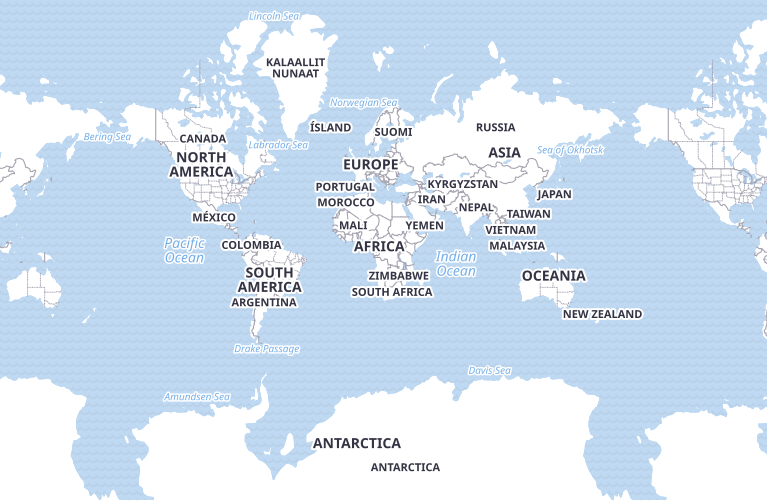

# OpenMapTiles

This repository contains a GeoServer data directory that will render OpenMapTiles maps using:
* MBTiles filled with Mapbox Vector Tiles as the source
* Mapbox GL Styles for the styling

In order to use this data directory you'll need:
1. A recent version of GeoServer, 2.17.x or newer. At the time of writing, January 2020, you'll need to pick the [nightly builds](https://build.geoserver.org/geoserver/master/), in the future a stable version might be usable too.
2. The [MBStyles community module](https://build.geoserver.org/geoserver/master/community-latest/)
3. The [MBTiles store community module](https://build.geoserver.org/geoserver/master/community-latest), in particular, the ``geoserver-<version>-mbtiles-store-plugin.zip`` file).
4. Download the [OpenMapTiles.com](https://openmaptiles.com/downloads/planet/) "OpenStreetMap vector tiles" file of the desired area (free only for non commercial usage)
5. Download the [Natural Earth II with Shaded Relief and Water
](https://www.naturalearthdata.com/downloads/10m-raster-data/10m-natural-earth-2/) raster background

Once the above has been gathered:
* Install GeoServer and the extensions
* Start it up, pointing it at this data directory
* Fix the ``omt:osm-openmaptiles`` data source location to match the MBTiles file downladed at point 4
* Fix the ``natural_earth_shaded_relief:natural_earth_shaded_relief`` URL parameter to match the file downloaded at point 5

Go to the layer preview, choose the ``osm-bright-gl`` group, and you should be greeted by this preview:

# Notes on the styles and rendering

The styles available in this data directory have been modified from their original version to care for some discrepancies
between style and data available for download. In particular:
* The ``aerodrome_labels`` layer is not available
* The ``brunnel`` and ``intermittent`` attributes are not available in the ``waterway`` layer
* The ``iso_a2`` attribute is not available in ``place``
* The ``level`` attribute is not available in ``poi``

At the time of writing the ``osm-bright-gl`` renders with reasonable fidelity and output (there are still visible differences) 
while the other available styles need more work in the style translation engine to display properly.
